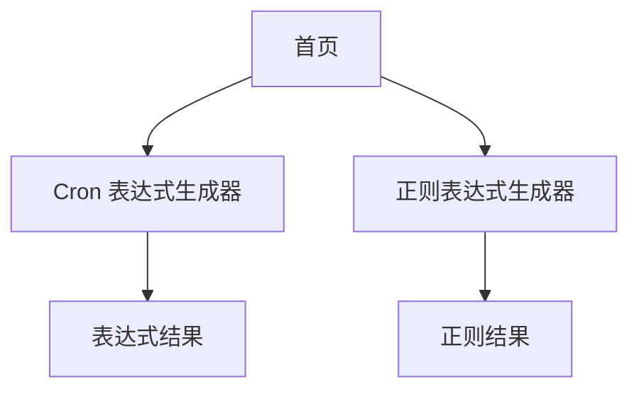

# 工具类网站产品需求文档

## 1. Product Overview
一个简洁实用的在线工具网站，为开发者和技术人员提供 cron 表达式生成和正则表达式生成两个核心功能。
- 解决开发者在编写定时任务和文本匹配规则时的效率问题，提供可视化的生成工具。
- 目标用户为程序员、系统管理员和技术爱好者，帮助他们快速生成准确的表达式。

## 2. Core Features

### 2.1 Feature Module
我们的工具网站包含以下主要页面：
1. **首页**：网站介绍、功能导航、快速入口
2. **Cron 表达式生成器**：可视化 cron 表达式构建、预览和验证
3. **正则表达式生成器**：常用正则模式选择、自定义构建、测试验证

### 2.2 Page Details

| Page Name | Module Name | Feature description |
|-----------|-------------|---------------------|
| 首页 | 导航区域 | 显示网站 logo、主导航菜单，提供工具快速入口 |
| 首页 | 功能介绍 | 展示两个主要工具的功能说明和使用场景 |
| 首页 | 快速开始 | 提供直接跳转到各工具页面的按钮 |
| Cron 表达式生成器 | 可视化构建器 | 通过下拉菜单和选择框设置分钟、小时、日期、月份、星期 |
| Cron 表达式生成器 | 表达式预览 | 实时显示生成的 cron 表达式和执行时间说明 |
| Cron 表达式生成器 | 常用模板 | 提供每分钟、每小时、每天等常用 cron 表达式模板 |
| 正则表达式生成器 | 模式选择器 | 提供邮箱、手机号、身份证等常用正则表达式模板 |
| 正则表达式生成器 | 自定义构建 | 允许用户手动输入和编辑正则表达式 |
| 正则表达式生成器 | 测试验证 | 提供测试文本输入框，实时验证正则表达式匹配结果 |

## 3. Core Process

用户访问网站后，可以通过首页导航选择需要的工具：
- **Cron 表达式生成流程**：选择时间参数 → 查看生成的表达式 → 复制使用
- **正则表达式生成流程**：选择模板或自定义 → 输入测试文本验证 → 复制使用

## 4. User Interface Design

### 4.1 Design Style
- **主色调**：蓝色系 (#2563eb) 作为主色，白色 (#ffffff) 作为背景色
- **辅助色**：灰色 (#6b7280) 用于次要文本，绿色 (#10b981) 用于成功状态
- **按钮样式**：圆角按钮，悬停时有阴影效果
- **字体**：系统默认字体，标题 18-24px，正文 14-16px
- **布局风格**：卡片式布局，顶部导航栏，响应式设计
- **图标风格**：简洁的线性图标，配合少量表情符号增加友好感

### 4.2 Page Design Overview

| Page Name | Module Name | UI Elements |
|-----------|-------------|-------------|
| 首页 | 导航区域 | 顶部固定导航栏，蓝色背景，白色文字，居中 logo |
| 首页 | 功能介绍 | 两列卡片布局，每个卡片包含图标、标题和描述文字 |
| 首页 | 快速开始 | 大号按钮，蓝色背景，白色文字，圆角设计 |
| Cron 表达式生成器 | 可视化构建器 | 表单布局，下拉选择框，实时预览区域 |
| Cron 表达式生成器 | 表达式预览 | 代码框样式，等宽字体，复制按钮 |
| 正则表达式生成器 | 模式选择器 | 按钮组布局，常用模板按钮 |
| 正则表达式生成器 | 测试验证 | 两栏布局，左侧输入框，右侧匹配结果高亮显示 |

### 4.3 Responsiveness
网站采用移动端优先的响应式设计，在桌面端、平板和手机上都能良好显示，支持触摸操作优化。